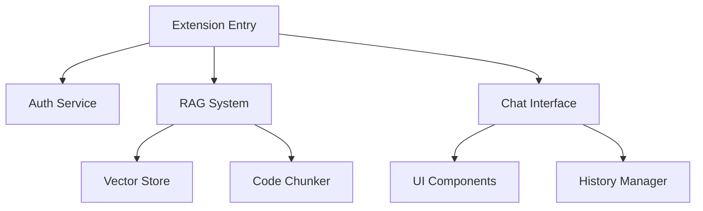

# MEmoX ✨ | Your Intelligent Coding Companion

<div align="center">
  <!-- Logo commented out until proper image is available -->
  <!--  -->
  <h3>Code Smarter, Build Faster</h3>
  <p>Seamless AI assistance that works where you work - online or offline.</p>
</div>

## 💡 Why MEmoX?

MEmoX empowers developers with AI-driven insights directly within VS Code. Whether you're connected to the internet or working in an isolated environment, MEmoX adapts to your needs with its innovative dual-mode operation.

## ✨ Key Features

<table>
  <tr>
    <td width="50%">
      <h3>🧠 Smart Coding Assistant</h3>
      <ul>
        <li>Get instant answers about your codebase</li>
        <li>Receive contextual improvement suggestions</li>
        <li>Generate documentation with a single prompt</li>
        <li>Debug complex issues with AI guidance</li>
      </ul>
    </td>
    <td width="50%">
      <h3>🔄 Work Anywhere</h3>
      <ul>
        <li><b>Offline Mode:</b> Powered by local CodeLLaMA via Ollama</li>
        <li><b>Online Mode:</b> Enhanced capabilities through cloud APIs</li>
        <li>Seamless switching based on connectivity</li>
      </ul>
    </td>
  </tr>
  <tr>
    <td width="50%">
      <h3>🔍 Deep Code Understanding</h3>
      <ul>
        <li>Advanced semantic search with vector indexing</li>
        <li>Context-aware responses to your queries</li>
        <li>Support for multiple languages and frameworks</li>
      </ul>
    </td>
    <td width="50%">
      <h3>🛡️ Privacy-First Design</h3>
      <ul>
        <li>Secure GitHub authentication</li>
        <li>Local processing option for sensitive code</li>
        <li>Transparent data handling policies</li>
      </ul>
    </td>
  </tr>
</table>

- 🔒 **Secure Authentication**
  - GitHub OAuth integration for secure sign-in
  - Personal access token support for alternative authentication
  - Securely stored credentials

## 🚀 Getting Started

### Prerequisites

```
✅ VS Code 1.85.0+
✅ Node.js 16.x+
✅ For offline mode: Ollama with CodeLLaMA
```

### Quick Installation

```bash
# Clone the repository
git clone https://github.com/MemoraNet/MEmoX.git

# Navigate to the directory
cd MEmoX

# Install dependencies
npm install

# Build the extension
npm run compile

# Start using it!
code .
```

### Installation from VS Code Marketplace

1. Open VS Code Extensions panel (`Ctrl+Shift+X` or `Cmd+Shift+X`)
2. Search for "MEmoX"
3. Click "Install"
4. Reload VS Code when prompted

## ⚙️ Configuration

Customize MEmoX through VS Code settings:

| Setting | Description | Options |
|---------|-------------|---------|
| `memox.mode` | Operation mode | `auto`, `offline`, `online` |
| `memox.modelSize` | Local model size | `auto`, `3B`, `7B` |
| `memox.githubAuth` | GitHub authentication | OAuth credentials |
| `memox.indexDepth` | Code indexing depth | `standard`, `deep` |

### Environment Variables

For sensitive credentials, MEmoX supports environment variables via a `.env` file:

```
# GitHub OAuth credentials
GITHUB_CLIENT_ID=your_github_client_id_here
GITHUB_CLIENT_SECRET=your_github_client_secret_here

# OpenAI API credentials for cloud capabilities
OPENAI_API_KEY=your_openai_api_key_here
OPENAI_API_URL=https://api.openai.com/v1/chat/completions
```

Copy `.env.example` to `.env` and add your credentials. This file is automatically ignored by Git for security.

## 🔐 Authentication

MEmoX provides a streamlined authentication experience:

1. Click the **"Sign In"** button in the MEmoX panel
2. Authorize with GitHub (or use a Personal Access Token)
3. Start using all features immediately

<details>
<summary><b>📘 Detailed Authentication Instructions</b></summary>

For enterprise setups and custom configurations, see our [Authentication Guide](docs/authentication.md).
</details>

## 🛠️ Development

### Architecture Overview

MEmoX is built with modularity and performance in mind:



### Project Structure

```
src/
├── auth/           # Authentication components
├── chat/           # Chat UI and history management
├── rag/            # Retrieval-augmented generation system
└── extension.ts    # Main extension file
```

### Development Workflow

```bash
# Watch mode for development
npm run watch

# Run linting
npm run lint

# Run tests
npm run test
```

## 👥 Contributing

We welcome contributions! Check out our [contribution guidelines](CONTRIBUTING.md) to get started.

## 📄 License

[MIT License](LICENSE) - Copyright © 2025 MemoraNet

## 📊 Usage Examples

### Ask About Your Code

```
> Explain the purpose of the RAGManager class in this project
```

### Generate Code with Context

```
> Create a function to parse the user input and extract keywords
```

### Get Debugging Help

```
> Why is my message not showing in the chat panel?
```

## 🌟 Community & Support

- 💬 [Join our Discord](https://discord.gg/memox)
- 🐛 [Report Issues](https://github.com/MemoraNet/MEmoX/issues)
- 📧 [Contact Support](mailto:support@memoranet.com)

---

<div align="center">
  <sub>Built with ❤️ by the MemoraNet team</sub>
</div>